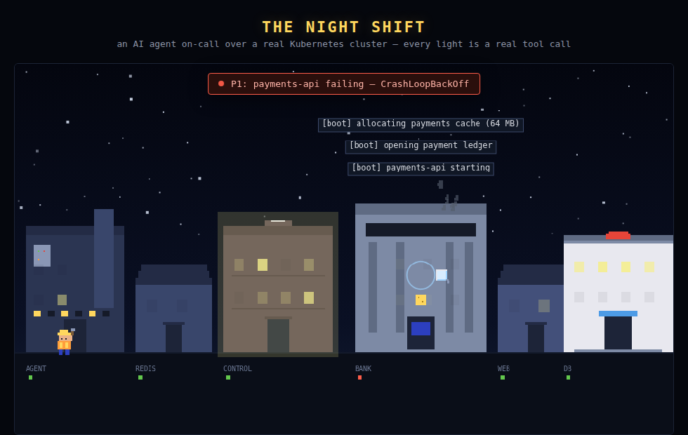
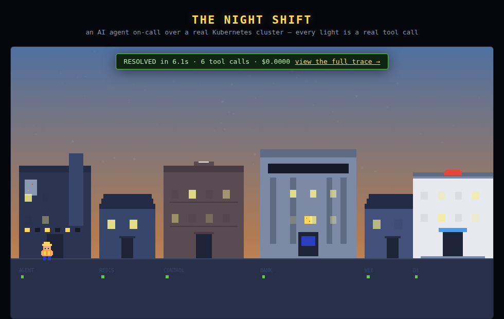

# The Night Shift

<p align="center">
  
</p>

> **Watch an AI agent get paged at 3 AM, diagnose a crashing service on a real
> Kubernetes cluster, and heal it — rendered as a pixel-art city where every
> light is a real tool call.**

The city below the canvas is a **real k3d Kubernetes cluster** running on a VPS.
The bank (`payments-api`) really crashes: a 32Mi memory limit against a 64MB
allocation, so the container is **genuinely `OOMKilled`** (exit 137) over and
over. An LLM agent gets paged, investigates through guarded tools, raises the
limit with the one write tool it has, and verifies the recovery. Smoke, log
bubbles, the repair sprite, the dawn — every visual event carries the trace
line (`agent_seq`) that caused it. **No event, no pixels.**

**Live:** https://samibre.dev/night-shift/ · **Proof panel:** rendered per run
from the raw JSONL trace, side-by-side with the city events it produced.

| | |
| --- | --- |
|  |  |

## Architecture

```
┌───────────────────┐  POST /api/run   ┌─────────────────────────────────────┐
│  browser (canvas) │ ────────────────►│  FastAPI (uvicorn, 127.0.0.1:8808)  │
│  web/city.js      │                  │                                     │
│  sprite sheet     │◄───── SSE ───────│  runner: stage incident (real       │
└───────────────────┘  city events     │  kubectl patch to 32Mi)             │
        ▲                              │    → LangGraph ReAct agent          │
        │ every event carries          │      reason ─ act ─ finalize        │
        │ agent_seq (trace line)       │    → cluster watcher (real pod      │
        │                              │      status every 3s)               │
┌───────┴──────────────┐               │    → CityMapper: agent + cluster    │
│  k3d cluster          │◄── kubectl ──│    events → city events             │
│  namespace: city      │  (guarded)   │  runs/<id>/trace.jsonl  (raw)       │
│  payments-api OOMKill │              │  runs/<id>/city_events.jsonl        │
│  web, redis, postgres │              └─────────────────────────────────────┘
└───────────────────────┘
```

- **Agent** (`nightshift/graph.py`): LangGraph ReAct loop — `reason → act →
  finalize`, max 10 steps, strict-JSON replies, guard denials come back as
  observations so the model adapts instead of fighting the guardrail.
- **Tools** (`nightshift/tools.py`): guards live in the tool layer, never the
  prompt. `kubectl_get/describe/logs` are fixed-argv read-only (the model can
  only fill validated slots — `delete/apply/exec` are unreachable by
  construction). `kubectl_patch_limits` is the ONLY write tool: it refuses
  everything except a memory-limit patch on one container of one Deployment
  (quantity validated, 8Mi..4096Mi, exact JSON-patch path).
- **Honesty layer** (`nightshift/citymap.py`): smoke only while the pod is
  *really* failing (cluster watcher polls real state every 3s), log bubbles
  contain the *actual* log tails the agent read, dawn only after the recovery
  is *really* confirmed. If the cluster is down, the page says so.
- **Real state on load**: the page queries `/api/status` and mirrors the real
  cluster — broken (bank smoking/flickering, P1 banner, "waiting for the
  agent") while `payments-api` is actually crash-looping, healthy right after
  a recovery. An incident timer re-breaks the app 10 min after a recovery
  (`NIGHTSHIFT_INCIDENT_RESET_S`), so the demo's resting state is always a
  live incident.
- **Mission-control sidebar**: every tool call streams live next to the city —
  tool name, args, verdict (`ok` / `error` / `denied` / `cluster_unavailable`)
  and wall-clock duration — fed by `type: agent` records on the same SSE stream
  that drives the city. LLM request/response internals stay in the trace report.
- **Providers** (`nightshift/llm.py`): `MockLLM` (canned deterministic script,
  zero API spend — the default everywhere) and `OpenRouterLLM` (flash-class,
  temperature 0) for live runs. Live diagnosis is open-ended: the prompt
  describes the alert, not the fix, so real traces differ run to run.

## Quickstart (mock mode needs NO API key)

```bash
git clone https://github.com/sami-bre/night-shift && cd night-shift
make cluster-up     # docker + k3d + kubectl + the (broken) city — idempotent
make serve          # FastAPI on 127.0.0.1:8808
open http://127.0.0.1:8808/   → click "Run the night shift"
make test           # 38 tests: guards, agent loop, city mapping, tool feed, SSE, budget
```

For live runs, the backend needs `OPENROUTER_API_KEY` in its environment
(see `/etc/nightshift.env` on the demo VPS); `NIGHTSHIFT_LIVE_ENABLED=false`
forces mock-only, `NIGHTSHIFT_DAILY_SPEND_CAP_USD` tunes the daily cap.

## Scene beats

1. **Idle night** — calm city, twinkling windows, live status line fed by real
   cluster state. On load, the last archived shift replays (labeled "replay").
2. **The page** — the bank starts smoking *because the pod is actually
   failing*; alert banner: `P1: payments-api failing — CrashLoopBackOff`.
3. **The response** — each tool call maps to a city event: `kubectl_get` →
   town hall lights up; `kubectl_logs` → the bank speaks its real log tail;
   `kubectl_describe` → magnifier ping; `kubectl_patch_limits` → the repair
   sprite walks to the bank and hammers; verification → windows relight.
4. **Dawn** — sky lightens only after the cluster watcher confirms the pod is
   `Running`; banner: `RESOLVED in Ns · X tool calls · $0.000N` + trace link.
5. **Proof panel** — raw JSONL trace beside the city events it produced, one
   click away (`/api/runs/<id>/trace`).

## Runs & budget (public deployment)

**Public visitors always get deterministic mock runs** — real OpenRouter runs
happen only on explicit demand behind the `NIGHTSHIFT_LIVE_TOKEN` header
(spend ≈ $0.006/run, flash-class). The live path still carries a hard
**$2.00/day spend cap** enforced server-side from the archived per-run spend
counters (fallback: mock + UI notice). Also enforced for everyone:
1 concurrent run · 10-minute per-IP cooldown · daily live-run count cap.
Archived runs replay for anyone, forever.

## Honest limitations

- The "city" is one k3d node with four services — a real pager would be
  louder. The point is the audited-agent pattern, not the scale.
- `ensure_incident()` re-breaks `payments-api` before every run (a real
  `kubectl patch` to 32Mi). If the cluster is down, the page degrades to an
  honest "cluster down" status instead of faking pod state.
- Live runs use temperature 0 with a short max-token budget; a malformed
  LLM reply ends the run with an error instead of improvising a fix.
- The sprite sheet is generated from `tools/gen_sprites.py` (Pillow) — the
  art is reproducible code, but it is simple pixel art, not game-grade.
- Auto-run scheduling from the original brief is realized as "replay of the
  last archived run on page load" rather than a cron.

## Layout

```
nightshift/   tools.py (guards) · graph.py (agent) · citymap.py · runner.py
              app.py (FastAPI/SSE) · llm.py · proof.py · scenario.py
web/          index.html · city.js · style.css · assets/sprites.png (generated)
tools/        gen_sprites.py · screenshots.py
k3d/          bootstrap.sh (idempotent) · manifests/ (the city)
tests/        guards · agent · citymap · server
docs/         screenshots + hero.gif (captured from a real run)
SPEC.md       full spec: tool surface, guard rules, event→city mapping table
DEMO_LOG.md   every live run's real spend
```

## License

MIT — see [LICENSE](LICENSE).